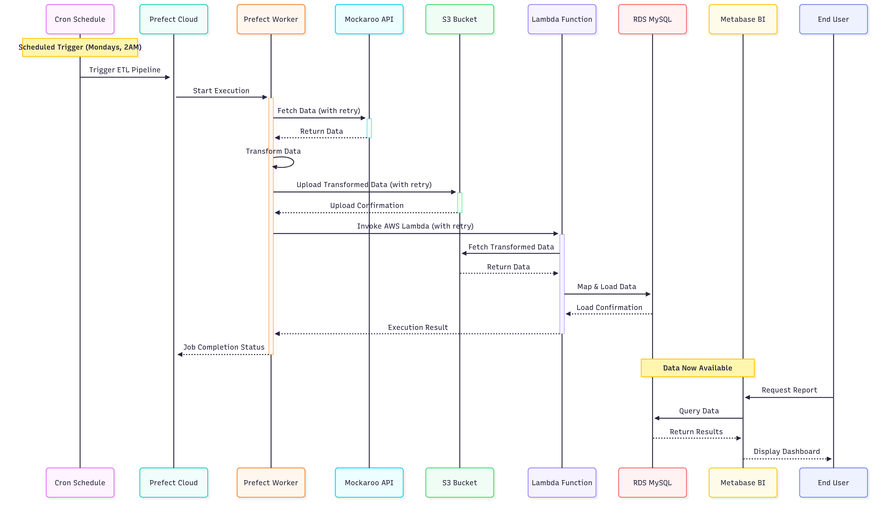
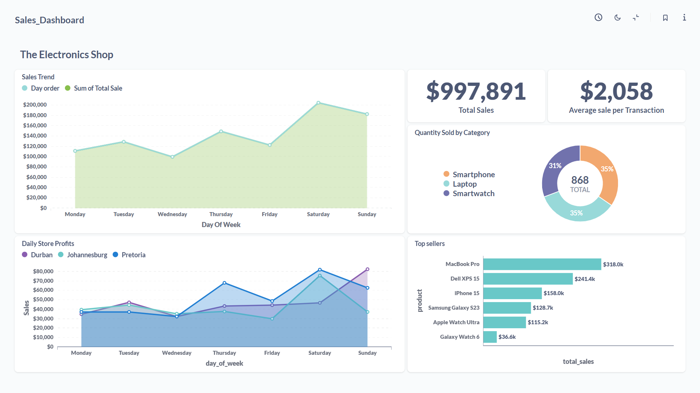

# __Automated-Sales-Pipeline-Dashboard__

# Table of Contents

1. [Project Overview](#project-overview)  
2. [Tech Stack](#tech-stack)  
3. [Architecture](#architecture)  
4. [How it Works](#how-it-works)  
5. [Dashboard](#dashboard)  
6. [Monitoring](#monitoring)  
7. [CI/CD](#cicd)  
8. [Environment Setup](#environment-setup)  
   - [1. Mockaroo](#1-mockaroo)  
   - [2. Fork and Clone the Repo](#2-fork-and-clone-the-repo)  
   - [3. Virtual Environment](#3-virtual-environment)  
   - [4. Terraform Setup and AWS Deployment Guide](#4-terraform-setup-and-aws-deployment-guide)  
     - [4.1 Terraform Installation](#41-terraform-installation)  
     - [4.2 Project Setup and Configuration](#42-project-setup-and-configuration)  
     - [4.3 Deploying AWS Services](#43-deploying-aws-services)  
     - [4.4 Accessing Metabase and Initializing RDS](#44-accessing-metabase-and-initializing-rds)  
   - [5. S3 Bucket Information](#5-s3-bucket-information)  
   - [6. Prefect Cloud Setup and Credential Management](#6-prefect-cloud-setup-and-credential-management)  
     - [6.1 Create API Key](#61-create-api-key)  
     - [6.2 Configure Prefect Blocks for Credentials](#62-configure-prefect-blocks-for-credentials)  
     - [6.3 Configure Prefect Worker Pool](#63-configure-prefect-worker-pool)  
     - [6.4 Configure GitHub Secrets](#64-configure-github-secrets)  
   - [7. Scripts and YAML Files](#7-scripts-and-yaml-files)  
9. [Deploying](#deploying)  
10. [EC2 Server Application](#ec2-server-application)  

## __Project Overview__
This project implements an automated data pipeline that runs on a weekly schedule to extract, transform, and load (ETL) sales data. The pipeline is orchestrated using Prefect, with data flowing from a synthetic data source (Mockaroo) through S3, and finally into an RDS MySQL database. After the data is loaded, a Metabase dashboard automatically refreshes to provide up-to-date weekly sales insights for end users.

The goal of this pipeline is to demonstrate an end-to-end solution for automated data ingestion, transformation, and business intelligence reporting all fully deployed on AWS and Prefect Cloud, using scalable, modular components.


## __Tech Stack__

- **Prefect Cloud** – Workflow orchestration
- **AWS S3** – Storage for raw and transformed data
- **AWS Lambda** – Serverless compute to load data into RDS
- **Amazon RDS (MySQL)** – Relational database for structured storage
- **Metabase** – Business Intelligence and dashboarding
- **Mockaroo** – Synthetic data source
- **Terraform** – Infrastructure as Code 

## Architecture


This diagram shows the flow of data from → Mockaroo → S3 → Lambda → RDS → Metabase, At the heart of this system is Prefect, a modern workflow orchestration framework that automates and schedules the entire ETL process. Using Prefect Cloud, the pipeline runs seamlessly on a weekly basis without manual intervention enabling scalable, reliable, and observable data workflows across cloud services

## __How it works__


The data flows through the pipeline in a series of automated steps:

__1.Scheduled Trigger:__ The entire ETL pipeline is initiated by a scheduled trigger (e.g., a weekly cron job at 2 AM) configured within Prefect Cloud.

__2.ETL Pipeline Start (Prefect):__ Prefect Cloud signals a Prefect Worker to start the ETL execution. A prefect worker is a background process that runs and executes your Prefect flows and tasks.

__3.Data Extraction (Python via Prefect):__ The Prefect Worker executes the Python ETL script. This script connects to the Mockaroo API to fetch the "Raw Data" (CSV).

__4.Data Transformation (Python via Prefect):__ The Python script then performs all necessary data cleaning and transformation operations on the raw data. This results in "Transformed Data," typically split into multiple CSV files for organizational purposes.
The Python script then performs all necessary data cleaning and transformation operations on the raw data. This process includes data modeling, restructuring the raw data and outputting it into multiple CSV files. Each of these CSVs is designed to represent a specific, structured dataset, typically corresponding to a distinct table in the target relational database.

__5.Data Staging (Python to S3):__ The Python script loads the "Transformed Data" (multiple CSVs) into the designated S3 Bucket.

__6.Load Orchestration (Prefect to Lambda):__ Once the data is uploaded to S3, Prefect invokes an AWS Lambda Function. This Lambda function is specifically designed to handle the loading of data from S3 into the database.

__7.Data Loading (Lambda to RDS MySQL):__ The Lambda Function fetches the transformed data from the S3 Bucket, performs final mapping, and loads it into the appropriate tables within the RDS MySQL Database.

__8.Job Completion & Data Availability:__ Upon successful loading, the Lambda function signals back to Prefect, indicating the completion of the loading phase. At this point, the data is "Data Now Available" in the database.

__9.Business Intelligence (Metabase):__ Metabase BI continuously queries the RDS MySQL Database.

__10.User Consumption:__ End Users interact with Metabase to request reports or view dashboards, allowing them to query the newly available data and gain insights.

## __Dashboard__

<table>
  <tr>
    <td style="text-align: center;">
      <br/>
      <b>Figure 1:</b> Week 1
    </td>
    <td style="text-align: center;">
      <br/>
      <b>Figure 2:</b> Week 2
    </td>
  </tr>
</table>

The images above display the dashboard for two different weeks. The second image reflects the updated dashboard with refreshed data.

## __Monitoring__
Since the front end runs on AWS services, an AWS CloudWatch dashboard is used to monitor the health and performance of key infrastructure components including EC2, RDS, and S3. The dashboard tracks metrics such as available storage in RDS and S3 buckets, EC2 read/write bytes, and CPU utilization, providing real-time visibility into system resource usage, A comprehensive overview of these metrics is available in the documentation, which includes detailed views of EC2, RDS, and S3 performance indicators.

Since the prefect worker is running on Prefect's hosted infrastructure ("Prefect hardware"), direct monitoring of the underlying machine is not possible. However, the Prefect UI clearly indicates the worker status, if it shows as "Ready", it means the worker is actively polling and available to execute flows. If the status is not ready, scheduled flows will not run.

The prefect worker provides detailed logs for each step of the ETL process, making it easy to trace the execution path. Additionally, notifications (such as email alerts) are sent automatically on flow success or failure, ensuring visibility into pipeline outcomes.

## CI/CD
Changes made to the scripts are deployed only if the CI/CD pipeline passes successfully.  
This ensures that no broken code with errors is pushed to production.  
The CI/CD pipeline runs configuration checks, test scripts, and other validations.  
Only after passing all these checks is the flow deployed.


## __Environment setup__

> **Note:** The AWS services used in this project are mostly within the Free Tier. However, **insignificant charges may still occur** depending on usage.  
> It is recommended to use this repository only if you have some experience with **AWS** and **Terraform**.  
> If you'd prefer to integrate with your own set of cloud services or alternatives, you are free to modify and replace the existing configuration to suit your setup.


### 1.Mockaroo
First, head to [Mockaroo](https://www.mockaroo.com) and sign up for an account.  
After signing up, open a new tab and paste this link: [Mockaroo Dataset](https://www.mockaroo.com/0935e020) to clone the schema.  

Once cloned, navigate to the profile icon to find your API key. Make sure to store it securely.

### 2.Fork and Clone the repo
```
git clone https://github.com/LamelK/automated-sales-pipeline-dashboard.git
```

### 3.Virtual environmenet
- It is recommended to use a Linux terminal (e.g., WSL). 
- create a Python 3.9 environment using either venv or conda(need to install first). After creating the environment, activate it and install the required packages.

Change the directory to the root folder of the repository.
```
pip install -r requirements.txt
```

### 4. Terraform Setup and AWS Deployment Guide
#### 4.1. Terraform Installation
-   Terraform is not included in `requirements.txt` as it is a separate CLI tool, written in Go, not a Python package.
-   Refer to the [Terraform Installation Guide (Official)](https://developer.hashicorp.com/terraform/tutorials/aws-get-started/install-cli) for guidance on how to install Terraform.

#### 4.2. Project Setup and Configuration
- Once installed, in your terminal, change directory to your Terraform folder.
- Input this command to generate the SSH key for your EC2 instance, secure this key as it will be used to ssh in your instance:
    ```bash
    ssh-keygen -t rsa -b 4096 -f ./metabase
    ```
- After generating the keys, you can open `variables.tf` or `main.tf` to customize values such as the S3 bucket name, RDS database name, username, region, etc., according to your preferences.
- You may also want to change the EC2 instance type in both `main.tf` and `variables.tf`. While `t3.micro` works, it may require swap memory for smoother operation. Alternatively, you can use `t3.small` or another instance type with more memory.
        -   ⚠️ **Note:** Any instance besides `t2.micro` and `t3.micro` are not included in the AWS Free Tier, so charges may apply.

#### 4.3. Deploying AWS Services
-  Ensure that you have your AWS credentials configured in your system.
-  in the same folder as the terraform files,type `terraform plan` in the terminal. This will show your spin-up plan and any other errors that might have been improperly configured.
-  After reviewing the plan, type `terraform apply`. This process will take a while as it spins up AWS services.
-  If not successful, see which services failed and fix them.
-  If successful, it will show you some credentials. Store them safely. The DB password will not be displayed. To get it, type:
    ```bash
    terraform output db_password
    ```
    Save this password safely.

#### 4.4 Accessing Metabase and Initializing RDS
- Navigate to the AWS Console -> EC2 -> select your server and copy the public IP.
- Paste this into a new browser tab: `https://<public-ip>:3000`. This should open the Metabase application.
- If the page can't be reached, it means Metabase didn't install successfully during spin-up. You will have to SSH into the instance, using that key you generated previously

    ```bash
    ssh -i "automated-sales-pipeline-dashboard/terraform/metabase" ubuntu@<public-ip>
    ```
    Once connected, install Java 21 first, then Metabase, and finally start the Metabase service manually.
- Then, head to the Lambda service in the AWS Console and select the `rds-initializer` function. Go to the "Test" tab and test the function.     This will initialize the schema in your RDS database.It is crucial to initialize the schema before running the whole workflow
- Metabase will also prompt you to enter the **database name**, **username**, **password**, and **host**.  
Use the values you received from the Terraform output — this step links Metabase to the RDS instance.


### 5. S3 Bucket Information
- Go to S3 in the AWS Console and make note of the S3 bucket name. This bucket will be used by your data pipeline.

### 6. Prefect Cloud Setup and Credential Management
##### 5.1 Create API Key
- Go to the Prefect UI at [Prefect Cloud](https://app.prefect.cloud).
- Click your **profile icon** (usually top-left) and select **"API Key"**.
- Create API Key
- After creation, you will receive the API key (Access Token) and login url. **Store this securely immediately**, as it is shown only once and cannot be retrieved later.

##### 6.2. Configure Prefect Blocks for Credentials
- In the Prefect UI, navigate to **Settings**.
- Select **Blocks** and Click **Create Block**.
- Choose the **Secrets** block type.
- Create a block named `credentials`.
- In the block's configuration, input your sensitive information in JSON format. Replace the asterisks with your actual values:
    ```json
    {
      "S3_BUCKET_NAME": "your_s3_bucket_name",
      "PREFECT_API_KEY": "your_prefect_api_key",
      "MOCKAROO_API_KEY": "your_mockaroo_api_key",
      "AWS_ACCESS_KEY_ID": "your_aws_access_key_id",
      "AWS_SECRET_ACCESS_KEY": "your_aws_secret_access_key"
    }
    ```
    * You will input all your details you just created 
- Create another block but this time choose the **AWS Credentials Block**
- Go back to the **Blocks** page.
- Input your AWS `ACCESS_KEY_ID` and `SECRET_ACCESS_KEY` into the respective fields provided within this block.

##### 6.3. Configure Prefect worker pool
- Navigate to **Worker Pools** from the left-hand menu and create a new worker pool.  
  The Hobby tier only supports the **Managed** worker pool type, so select that option.  
  Name the worker pool **etl-workpool**, leave the other fields as default, and click **Create**.

##### 6.3. Configure GitHub secrets
- On your forked repo, navigate to **Settings** → **Secrets and variables** → **Actions**.
- Click **New repository secret** and add the following:
  - `PREFECT_API_KEY`
  - `AWS_ACCESS_KEY_ID`
  - `AWS_SECRET_ACCESS_KEY`

### 7. Scripts and yaml files
#### Yaml
- In the workflow YAML file **prefect-ci-cd.yaml**, update the Prefect login command to match your account.  
  You can find your workspace name in the Prefect Cloud UI under **Settings → Workspaces**.  
  Also, ensure your GitHub secrets are configured as described above.

- In the **prefect.yaml** file, update the following:
  - Replace the placeholder S3 bucket name with **your actual S3 bucket name**.
  - Replace the `AWS_ROLE_ARN` value with the **IAM role ARN assigned to your Lambda function**.

  These changes are required to allow the flow to access your S3 bucket and invoke the Lambda function securely.


#### Scripts
- In the `etl_flow.py` script, locate the `lambda_function_name` variable and replace its value with your Lambda function name:  
  ```python
  lambda_function_name = "s3-to-rds-loader"
- In the `test_etl_flow.py` file, go to line 96 and replace the argument in the mock assertion with your Lambda function name:
  ```python
  mock_lambda_submit.assert_called_once_with("s3-to-rds-loader")
  ```
- In the lambda_invoke.py script, ensure that the AWS region matches the region used in your Terraform configuration.
  This ensures the Lambda invocation works correctly within your chosen AWS region.

To test the flow locally, run the `run_pipeline.py` script.  
Then, go to the Prefect UI to observe the flow execution.  
If there are any errors, check the logs in the UI and address them accordingly.

### Deploying
- Add your changes, commit them, and push to GitHub — this should trigger the CI/CD workflow.
- The CI/CD will pass when:
  - All test scripts succeed
  - All required credentials and configurations are correctly set
- Once the workflow runs successfully, go to the Prefect UI → **Deployments**, and you should see `etl-deployment` with a status of **Ready**.
  You can now execute this deployment by select options `quick-run`, which will run the entire pipeline. You can monitor the flow execution and logs directly from the UI.
- Note: GitHub may queue the workflow if the repository is forked, as forked repos are given lower priority.
  If you want faster execution, you can install a self-hosted runner on your machine.  
  If you do that, you may also need to run:
  ```
  git config --global --add safe.directory "/home/your-username/actions-runner/_work/automated-sales-pipeline-dashboard/automated-sales-pipeline-dashboard"
  ```
  This is because Git may block commands in the runner if the folder belongs to a different user.
  That command tells Git to trust the folder so the workflow can run without issues.

### EC2 server application
- Once the workflow runs successfully, you should have data loaded into the RDS database and linked to Metabase.  
  You can create a few charts in Metabase and save them.  
  After that, re-run the `etl-deployment` workflow from the Prefect UI.  
  When the flow completes, go back to Metabase — you’ll notice that the charts reflect the updated data.
- You can also set a **cron schedule** for your `etl-deployment` directly from the Prefect UI to automate the pipeline.


## License

This project is licensed under the MIT License


